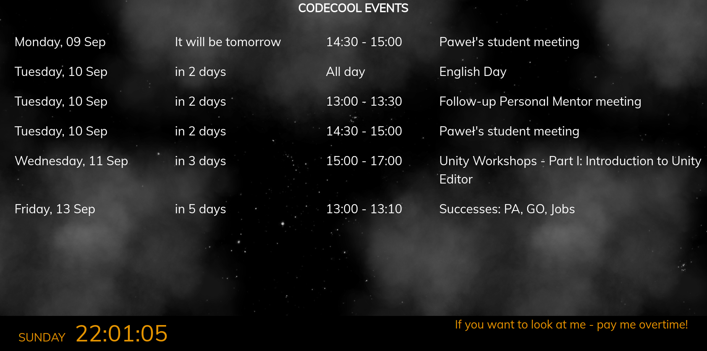
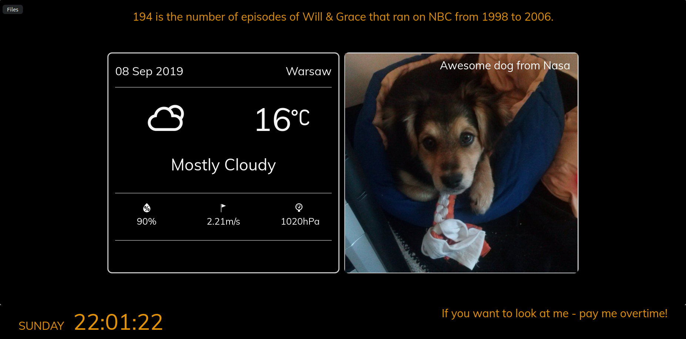
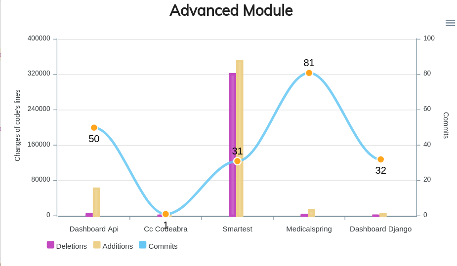

# Codecool Dashboard II
> Frontend part of project Codecool Dashboard.
First part (frontend) you can find [here](https://github.com/magg666/dashboard-django)

## Table of contents
* [General info](#general-info)
* [Screenshots](#screenshots)
* [Technologies](#technologies)
* [Setup](#setup)
* [Features](#features)
* [Status](#status)
* [Inspiration](#inspiration)
* [Contact](#contact)

## General info
Project was created as tool to display different statistics, information and news for Codecool students.
It displays:
* Clock with customize captions about time of day
* Image from Nasa Apod
* Weather in Warsaw
* Fun facts about numbers
* Github weekly statistics for students' projects
* Github total statistics for students' projects
* Calendar events
* Info about student's passed exams

## Screenshots
Calendar events:



Page with various infos (yes, that is the image of my dog, not Nasa. It serves as backup image):



Chart with Github statistic page:



## Technologies
Main:
* React
* html, css

Libraries:
* Apexcharts
* Material-ui
* Bootstrap
* Font Awesome
* Google api (gapi)


## Setup
Use package.json to download all needed dependencies, npm runserver.

## Code Examples
Class based components:
```javascript
export default class WeatherWidget extends React.Component {
    constructor(props) {
        super(props);
        this.state = {
            currentDayWeather: {
                time: null,
                temperature: null,
                summary: "",
                icon: "",
                humidity: null,
                pressure: null,
                windSpeed: null,
            }
        }
    };
```
Functional components with Google api:
```javascript
export const Calendar = (props) => {
    // initial state
    let [eventsList, setEvents] = useState([]);

    function handleClientLoad() {
        gapi.load('client:auth2', checkAuth)
    }

    function checkAuth() {
        gapi.auth2.authorize({
            client_id: props.clientId,
            scope: 'https://www.googleapis.com/auth/calendar',
            immediate: true,
            prompt: 'none'
        }, handleAuthResult)
    }
```
Custom hooks:
```javascript
export function useInterval(callback, delay) {
        const savedCallback = useRef();

        useEffect(() => {
            savedCallback.current = callback;
        }, [callback]);

        useEffect(() => {
            function tick() {
                savedCallback.current();
            }

            if (delay !== null) {
                let id = setInterval(tick, delay);
                return () => clearInterval(id);
            }
        }, [delay]);
    }
```

## Features
Codecool Dashboard uses:
* Class based components
* Functions components
* Standard and custom hooks
* External Apis
* Customized and adapted charts
* Reacts handling events
* Css styling and animations

It is also adapted to displaying on monitors and tablets

## Status
Project is finished, but I do not exclude the possibility of further developments.

## Inspiration
Credits for:

[Maciej Jankowski](https://github.com/maciejjankowski) - Codecool mentor - for idea and help. Thank you.

All Codecool mentors and student.

And, of course and as always - StackOverflow... :)

## Contact
Created by [Magda Wąsowicz](mailto:mw23127@gmail.com) - feel free to contact me!
